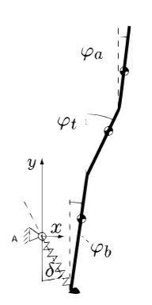
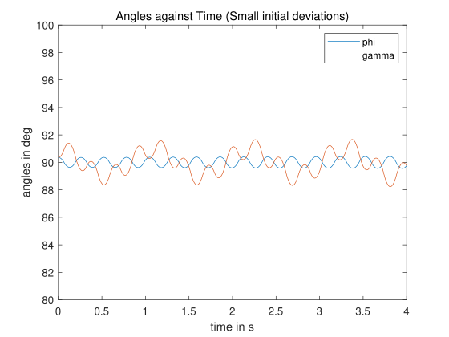

# RL controllers for slacklining robots
This repo is for course ME41125 'Introduction to Engineering Research'. This project aims to prove the adaptabiliy of RL methods in lateral balance control tasks of slacklining robots and provide primary designs. Two RL controllers (SARSA and A2C) are designed and tested for two different robot models.


## Getting started

### Prerequisites
The SARSA controller is built  and tested in version 2020b. The A2C controller uses the structure shared by  [Kostrikov and Ilya](https://github.com/ikostrikov/pytorch-a2c-ppo-acktr-gail). Thus, following softwares and packages are needed.
* [MATLAB](https://www.mathworks.com/products/matlab.html) 
* Python 3 
* [PyTorch](http://pytorch.org/)
* [Stable baselines3](https://github.com/DLR-RM/stable-baselines3)
* gym
* matplotlib

### Installing
For Matlab, it is available on its [official  website](https://www.mathworks.com/products/matlab.html).
For Pytorch and other packages needed, follow:
```bash
# PyTorch
conda install pytorch torchvision -c soumith

# Other packages
pip install -r requirements.txt
```


## Train
You can skip this if you want. There are trained models in this repo.

For SARSA controller and the simple model, run 'train.m'. The mapping table will be stored in 'parameters.mat' file.

For A2C controller and the complex model, run:
```bash
python main.py
```
The trained model will be stored in 'trained_models' folder.


## Test and Animation
For SARSA controller and the simple model, run 'simulate_slackline.m'. 

For A2C controller and the complex model, run:
```bash
python enjoy.py
```
The plot of angles of robot against time and the animation of the movements will show. Run
```bash
python plot_results_single.py
```
The plot of the training process will show.


## Models
### Simple model (Controlled by SARSA Controller)

### Complex model (Controlled by A2C Controller)



## Results
### Training process of SARSA controller

### Training process of A2C controller

### Performance of SARSA controller

### Performance of A2C controller

### Animation for SARSA controller
See [SARSA animation](https://youtu.be/8sjQ9Q5fq_M)
### Animation for A2C controller
See [A2C animation](https://youtu.be/WeV17Qnzjig)


## License
This repo is licensed under [MIT](https://choosealicense.com/licenses/mit/) - see the LICENSE.md file for details.


## Acknowledgments
* The A2C controller is built based on the work of [Kostrikov and Ilya](https://github.com/ikostrikov/pytorch-a2c-ppo-acktr-gail). 
* The complex model and its equation of motions are provided by Prof. Heike Valley from TU Delft.
* Thanks for the guidance and advice from Prof. Heike Valley.